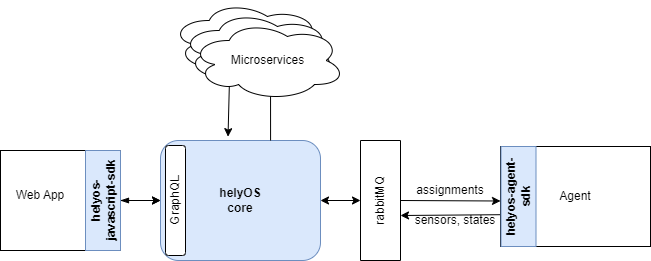
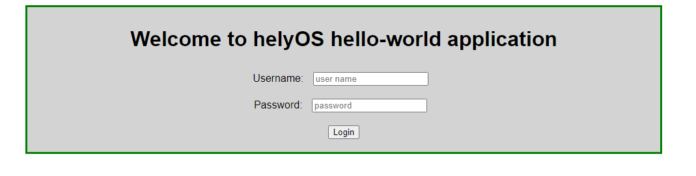
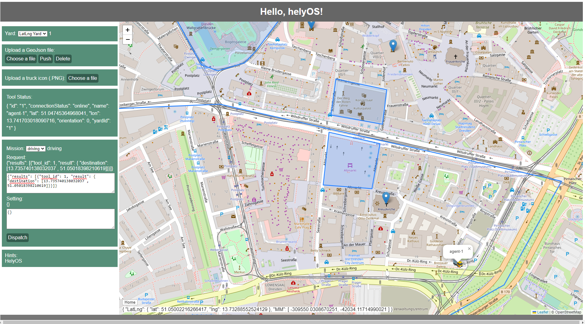

# Hello helyOS

## 1. Introduction

helyOS is a framework to accelerate the development of yard autonomous projects. The helyOS framework contains three software components: helyOS core, helyOS Agent SDK, helyOS JavaScript SDK. 



To display main features of helyOS, this repository build a minimalistic web application (hello helyOS) within helyOS framework. The structure of this repository are listed:

- *./hello_helyos*: The source code of hello helyOS frontend
- *./backend*: The docker image of helyOS core
- *./helyos_agent_slim_simulator*: The  docker image of helyOS agent simulator
- *./docs*: The tutorial of hello helyOS

The tutorial of this project can be visited via [Front App for helyOS](https://fraunhofer-ivi-helyos-frontend-example.readthedocs.io/en/latest/index.html).

## 2. Prior Knowledge

- Software as a service (SaaS)
- Web development (html, CSS, JavaScript)
- TypeScript
- Vue.js (or React, Angular, …)
- Web map API (leaflet map)

## 3. Build

To install this hello helyOS app, make sure you have docker installed, and then run the following commands.

### Starting the application
To start hello helyOS app docker container, run the following commands:
```
docker network create control-tower-net
docker-compose  -f ./hello_helyos/docker-compose.yml  up -d   
```
Once it is running, you can access to hello helyOS web app via  http://localhost:5174/. Login in with the admin account {"username": "admin", "password": "admin"}, or other accounts registered at helyOS Dashboard.

### Set the Backend
If you can't login in, check if you have helyOS core running. If not, run the following commands to install helyOS core as backend:
```
docker-compose  -f ./backend/docker-compose.yml up -d 
```

### Agent Simulator
If you want to try a slim agent simulator, run the following commands:
```
docker-compose  -f ./helyos_agent_slim_simulator/docker-compose.yml up -d  
```

### Terminating application and keeping database

- To terminate the hello helyOS web app
    
    `docker-compose  -f ./hello_helyos/docker-compose.yml down`
- To terminate the slim agent simulator
    
    `docker-compose  -f ./helyos_agent_slim_simulator/docker-compose.yml down`
- To terminate the backend (helyOS core)
    
    `docker-compose  -f ./backend/docker-compose.yml down`

*backend* is the last one to be shut down.

### Terminating the whole application and reseting database
```
docker-compose  -f ./hello_helyos/docker-compose.yml down
docker-compose  -f ./helyos_agent_slim_simulator/docker-compose.yml down
docker-compose  -f ./backend/docker-compose.yml down -v
docker network rm control-tower-net
```

## 4. Demo

If you build the whole app correctly, you can access to hello helyOS web app via  http://localhost:5174/.


Login in with the {"username": "admin", "password": "admin"}, or other accounts registered at helyOS Dashboard.



Features included in hello helyOS:
- Switch yards
- Upload, push, delete geojson file displayed as shapes (geojson examples stored at *./hello_helyos/src/assets/mock/*)
- Change icon of agents (icons stored at *./hello_helyos/src/assets/icon/*)
- Track tool status, position
- Select, dispatch a mission
- SDK hints

## 5. Useful Links

- [helyOS Dashboard](http://localhost:8080)
- [Hello helyOS](http://localhost:5174)
- [Hello helyOS Tutorial](https://fraunhofer-ivi-helyos-frontend-example.readthedocs.io/en/latest/index.html)
- [helyOS JavaScript SDK](https://github.com/FraunhoferIVI/helyOS-javascript-sdk)
- [helyOS Agent SDK](https://pypi.org/project/helyos-agent-sdk/)


## Author
- [Jiapan Wang](https://github.com/Wjppppp)

## License
This project is licensed under the MIT License
