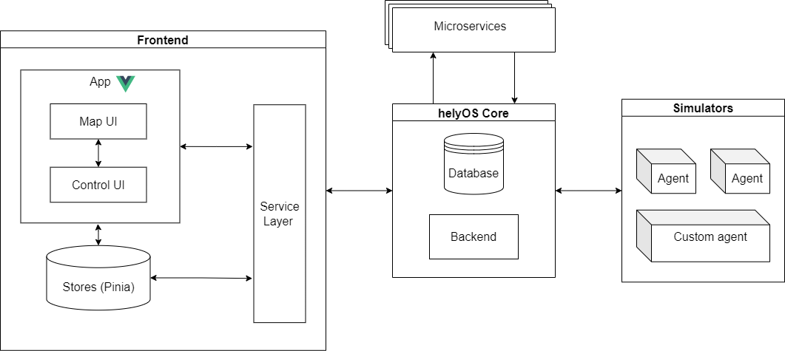
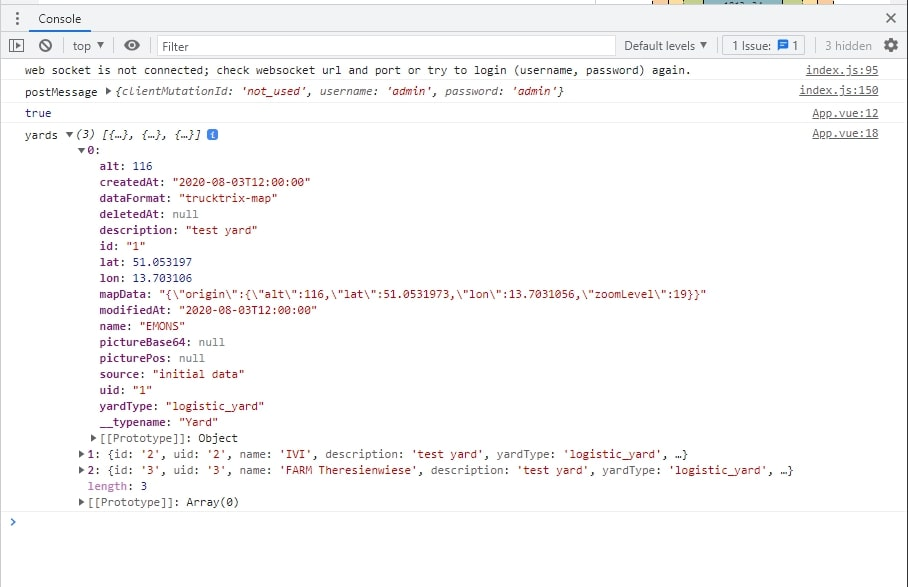
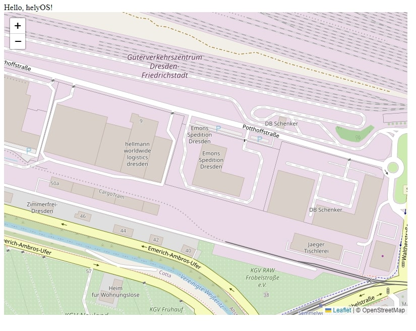

.. _GettingStarted:

Getting Started
================
In this chapter, you will learn how to build your first modern web app within helyOS framework. You will start by installing Vue.js as frontend framework and installing helyOS 
core as backend, install useful development tools (``helyosjs-sdk`` and ``leaflet``), and build your first hello-world helyOS-based web application.

Preparing your project
----------------------
This tutorial uses `Vue.js <https://vuejs.org/>`_, which is a JavaScript framework providing a declarative and component-based programming model that helps you efficiently 
develop a simple pr complex web application. To better increase project robustness, code management and team performance, `TypeScript <https://www.typescriptlang.org/>`_ 
will be used in this tutorial instead of pure JavaScript. Luckily, Vue is written in TypeScript itself and provides first-class TypeScript support.

Install Vue.js
^^^^^^^^^^^^^^
To start with TypeScript and Vue.js, It's highly recommended to use ``npm`` as the package manager for the Node JavaScript platform. Make sure you have an up-to-date version 
of `Node.js <https://nodejs.org/en/>`_ installed, then run the following command in your command line::

    > npm init vue@latest

This command will install and execute `create-vue <https://github.com/vuejs/create-vue>`_, the official Vue project scaffolding tool. You will be presented with prompts for 
several optional features such as TypeScript and testing support::

    √ Project name: ... <your-project-name>
    √ Add TypeScript? ... No / *Yes*
    √ Add JSX Support? ... *No* / Yes
    √ Add Pinia for state management? ... *No* / Yes
    √ Add Vitest for Unit Testing? ... *No* / Yes
    √ Add an End-to-End Testing Solution? » No
    √ Add ESLint for code quality? ... *No* / Yes
    
    Scaffolding project in ./<your-project-name>...
    Done.

Make sure you select **Yes** for **TypeScript**. If you are unsure about an option, simply choose ``No`` by hitting enter for now. Once the project is created, 
follow the instructions to install dependencies and start the dev server::

    > cd <your-project-name>
    > npm install
    > npm run dev

.. note:: 
    Note that the example components in the generated project are written using the ``Composition API`` and ``

    <template>
        <button @click="count++">Count is: {{ count }}</button>
    </template>

    

Set the Backend
^^^^^^^^^^^^^^^
To develop within helyOS, you need a running helyOS backend to receive mission requests and dispatch vehicles assignments. 

If you do not have access to a helyOS server, you can run your own locally by using the helyos_core docker image. This tutorial will guide you how to run helyOS 
locally by using docker image. Make sure you install `Docker <https://www.docker.com/>`_ before the following installation steps:

You will need the three images to run a helyOS backend.:

1. The helyos_core image that communicates with your app. 
2. The official image of the `postgres database <https://hub.docker.com/_/postgres>`_, where the helyOS stores its data.
3. The official image of the `rabbitmq:3-management <https://hub.docker.com/_/rabbitmq>`_, which will be the message broker to deliver the assignment to the vehicles (or vehicle simulators).

The easiest way to run these images and set the communication between their services is by using a docker-compose. You can find the docker-compose file with the 
correct configurations in the folder backend: *./backend/*

To spin up the server you must use the following commands::

    > docker network create control-tower-net
    > docker-compose -f ./docker-compose.yml up -d

To spin down your container::

    > docker-compose -f ./docker-compose.yml down

Using Vehicle Simulators
^^^^^^^^^^^^^^^^^^^^^^^^
When developing your application, you most probably will not have actual vehicles (agents) to evaluate it. Therefore, you will need agent simulators to mock the behavior of your vehicles within the application. 

You can develop your own simulators using the python library `helyOS-agent-sdk <https://github.com/FraunhoferIVI/helyOS-agent-sdk>`_, or you can use the agent slim simulator as docker image: agent_slim_simulator.

You find the docker-compose to run the simulator in the folder: *./helyos_agent_slim_simulator*

To run::

    > docker-compose -f ./docker-compose.yml up -d

.. note::

    It is important to run the simulator only after the helyOS server finishes its boot procedure.

First helyOS Frontend Application
---------------------------------
App Framework
^^^^^^^^^^^^^
Once frontend platform and helyOS backend are prepared, this chapter will introduce how to develop your first web application within helyOS framework. 
Here you can preview the infrastructure of helyOS-based web application.

    The infrastructure of helyOS-based web application

**Frontend** 
    Vue.js based web application, including **Service Layer** communicate with helyOS core by using ``helyOS JavaScript SDK``, **Map UI** by using ``Leaflet Map``, 
    **Control UI** by using ``Vue components`` and state management tool ``Pinia`` as **Stores**.

**helyOS Core**
    The helyOS core is a single NodeJS application serving the ports 5000, 5002, and 8080, respectively for the **PostGraphile GraphiQL**, **Websocket connections** and **dashboard GUI**. 
    helyOS core responds to database events. That is, the creation, update or delete of rows in the database tables trigger actions inside the helyOS core. Therefore the client 
    applications communicate with helyOS core by interacting with the helyOS database by ``GraphQL language``. Besides, helyOS core also plays the role of **mission manager** which 
    receives mission requests from frontend apps and use microservices to transform these requests in vehicle assignments.

**Microservices**
    It is the approach where the functionalities of a system are implemented using small and independent services. Each one of small services is provided by one independent server.

**Simulators**
    A simulator simulates an **Agent** with attributes that can receive assignments and publish status (e.g. automated vehicles, cameras, traffic lights...). It must have a unique identifier code 
    and be connected as a client to rabbitMQ.

Install helyOS JavaScript SDK
^^^^^^^^^^^^^^^^^^^^^^^^^^^^^
Web apps interact with helyOS by HTTP protocol using GraphQL language. To accelerate the development, one can optionally use `helyOS JavaScript SDK <https://github.com/FraunhoferIVI/helyOS-javascript-sdk>`_, 
which wraps the GraphQL commands in convenient TypeScript functions. The ``helyosjs-sdk`` allows the development of javascript applications using the helyOS framework. 
This library contains all necessary methods and entity types to build a front-end using helyOS as backend system.

To install ``helyosjs-sdk``, run the following command::

    > npm i helyosjs-sdk  --save

After ``helyosjs-sdk`` installed successfully, you can testify if it works. Adding the following code into your ``JavaScript`` part which is between ```` of your Vue file:

*./App.vue*

.. code:: typescript

    import { HelyosServices} from 'helyosjs-sdk';

    const helyosService = new HelyosServices('http://localhost', { socketPort: '5002', gqlPort: '5000' });
    const username = 'admin';
    const password = 'admin';

    helyosService.login(username, password)
    .then(response => helyosService.connect())
    .then(connected => { 
        console.log(connected);
        listYards();
    });

    const listYards = async () => {
        const yards = await helyosService.yard.list({});
        console.log("yards", yards);
        return yards;
    }

Run your project on browser (Google Chrome), and open the developer tool. If helyOS service on your device works well, you will get stored **yards** data from helyOS database, like this:

    listYards() returns all of yards from helyOS database

Each yard includes geographical information as attributes (mapData, lat, lon). To visualize your yards and other data afterwards, you need a map interface that like `Leaflet Map <https://leafletjs.com/>`_ 
is used in this tutorial.  

Install Leaflet Map
^^^^^^^^^^^^^^^^^^^
As introduced on `Leaflet Map <https://leafletjs.com/>`_ website, Leaflet is the leading open-source JavaScript library for mobile-friendly interactive maps. Weighing just about 42 KB 
of JS, it has all the mapping features most developers ever need.

To install ``leaflet``, you can refer `here <https://leafletjs.com/download.html>`_, or you can easily install using ``npm`` by running the following command::

    > npm install leaflet  --save
    > npm install --save @types/leaflet

Import ``leaflet`` module into your project by:

*./App.vue*

.. code:: javascript

    import "leaflet/dist/leaflet.css";
    import L from "leaflet";

If you want to start with Leaflet map quickly, please refer to this `Leaflet Quick Start Guide <https://leafletjs.com/examples/quick-start/>`_.

Use helyOS JS SDK and Leaflet Map
^^^^^^^^^^^^^^^^^^^^^^^^^^^^^^^^^
To create your first map view based on the geographical coordinates of the first yard from helyOS yard list, you need the following code in your Single-File Component:

*./App.vue*

.. code:: javascript

    const helyosService = new HelyosServices('http://localhost', { socketPort: '5002', gqlPort: '5000' });
    const username = 'admin';
    const password = 'admin';

    helyosService.login(username, password)
    .then(response => helyosService.connect())
    .then(connected => {
        console.log(connected);
        listYards();
    });

    const listYards = async () => {
        const yards = await helyosService.yard.list({});
        console.log("yards", yards[0]);

        // initiate the map
        initMap(yards[0].lat, yards[0].lon);

        return yards;
    }

    const initMap = (originLat: any, originLng: any) => {
        const leafletMap = L.map("mapContainer").setView([originLat, originLng], 17);
        // map layer
        L.tileLayer('https://tile.openstreetmap.org/{z}/{x}/{y}.png', {
            maxZoom: 19,
            attribution: '© OpenStreetMap'
        }).addTo(leafletMap);
    }

And you also have to define your ``mapContainer`` and the style of it:

*./App.vue*

.. code:: html

    <template>
        

 
    </template>
    

Now you have your first yard map on your interface, like this:

    helyOS yard shown on leaflet map

Congratulations! Now you have implemented your first map-based app within helyOS framework. 

So far, you have installed helyOS core container as backend, Vue.js as frontend development framework, and development tools (helyosjs-sdk and leaflet). All of pre-steps of developing an app 
within helyOS framework are prepared, so that you can start exploring helyOS from the following portals:

- `helyOS Dashboard <http://localhost:8080>`_
- `helyOS Web Demo <http://localhost:3080>`_
- `GraphiQL <http://localhost:5000/graphiql>`_
- `helyOS JaveScript SDK <https://fraunhoferivi.github.io/helyOS-javascript-sdk/index.html>`_

Keep going on, this tutorial will introduce more complicated applications with helyOS.

Usage Example
-------------
To help you better use with above tools, this section introduces some useful tips during development.

helyOS Services
^^^^^^^^^^^^^^^
As helyOS core is a single NodeJS application serving the ports 5000, 5002, respectively for the GraphiQL, Websocket connections, helyOS core responds to database events via the above ports. 
Therefore ``helyosjs-sdk`` provides an interface called ``HelyosServices`` connecting client applications to helyOS core. The connection has to be constructed before any communication with 
helyOS core by the following code:

.. code:: javascript

    import { HelyosServices } from 'helyosjs-sdk';

    const helyosService = new HelyosServices('http://localhost', {socketPort:'5002', gqlPort:'5000'});
    const username = 'admin';
    const password = 'admin';

    helyosService.login(username, password)
    .then( response => {
        console.log(response); // returns jwtToken when username and password are valid, otherwise undefined
        helyosService.connect()
        .then( connected => {
            console.log(connected); // returns true when connection is established, otherwise false
            /* Here you can communicate with helyOS database */    
        });
    });

To make synchronous-looking code asynchronous, you can also use ``async/await`` instead of ``then/catch``. The previous example will be like:

.. code:: javascript

    const login = async () => {
        const helyosReponse = await helyosService.login(username, password); // returns jwtToken when username and password are valid, otherwise undefined
        if (helyosReponse) {
            const connected = await helyosService.connect(); // returns true when connection is established, otherwise false
            console.log(connected);
            if (connected) {
            /* Here you can communicate with helyOS database */
            }
        }
    };
    login();

After connecting to helyOS core, ``HelyosServices`` serves as the portal to implement CRUD operations of other helyOS objects. For more operations about ``HelyosServices`` 
you can refer to documentation `Class HelyosServices <https://fraunhoferivi.github.io/helyOS-javascript-sdk/classes/HelyosServices.html>`_.

helyOS Models
^^^^^^^^^^^^^
There are several important model types among helyOS, that you can refer to `helyOS JS SDK <https://fraunhoferivi.github.io/helyOS-javascript-sdk/index.html>`_. The most used models are listed as following:

+----------------+----------------------------------------------------------------+
| Model          | Description                                                    |
+================+================================================================+
| H_Yard         | Physical space enclosing tools in a drivable area.             |
+----------------+----------------------------------------------------------------+
| H_Agents        | Tool represents any movable device that can perform an action  |
+----------------+----------------------------------------------------------------+
| H_Shape        | Define drivable areas or obstacles inside the yard.            |
+----------------+----------------------------------------------------------------+
| H_WorkProcess  | Group and serialize actions to be executed by the tools.       |
+----------------+----------------------------------------------------------------+

For each of helyOS model, ``helyosjs-sdk`` provides packaged CRUD operations, which interact with helyOS database via GraphQL language inside. 
Here is an operations example for ``H_WorkProcess`` type:

+-------------------------------------------------------+--------------------------------------------------+
| Command                                               | Description                                      |
+=======================================================+==================================================+
| helyosService.workprocess                             | Work Processes services                          |
+-------------------------------------------------------+--------------------------------------------------+
| .list (condition: Partial): Promise<H_WorkProcess[]>  | list all work processes filtered by condition.   |
+-------------------------------------------------------+--------------------------------------------------+
| .create (data: H_WorkProcess): Promise                | create work process.                             |
+-------------------------------------------------------+--------------------------------------------------+
| .get (workProcessId: number): Promise                 | get work process by ID.                          |
+-------------------------------------------------------+--------------------------------------------------+
| .patch (data: Partial): Promise                       | edit work process.                               |
+-------------------------------------------------------+--------------------------------------------------+

Besides, all of operations of other helyOS models can be found at `helyOS JS SDK Namespace\<internal\> <https://fraunhoferivi.github.io/helyOS-javascript-sdk/modules/_internal_.html>`_.

Where To Go From Here
---------------------
This is the end of the "Getting Started" tutorial. You started by installing Vue.js as frontend framework and installing helyOS core as backend, installing development tool (helyosjs-sdk and leaflet), 
and then implemented the basic communication between frontend and backend.

Now you can wither start developing your own app by yourself or follow the rest of tutorial which will introduce how to build a more complex web app with helyOS. 
Here you have some tips to continue learning:

- To learn more features about helyOS service for frontend app by going over :ref:`helyOS Main Features <helyOSMainFeatures>` 
- To learn how to build a complete helyOS-based app with Vue.js by going over :ref:`helyOS With Vue.js <helyOSWithVue>`.
- To get familiar with Vue.js and Composition API, you can read `Vue Guide <https://vuejs.org/guide/introduction.html>`_.
- To develop your own agent simulator, you can refer to `helyOS Agent SDK <https://pypi.org/project/helyos-agent-sdk/>`_.
