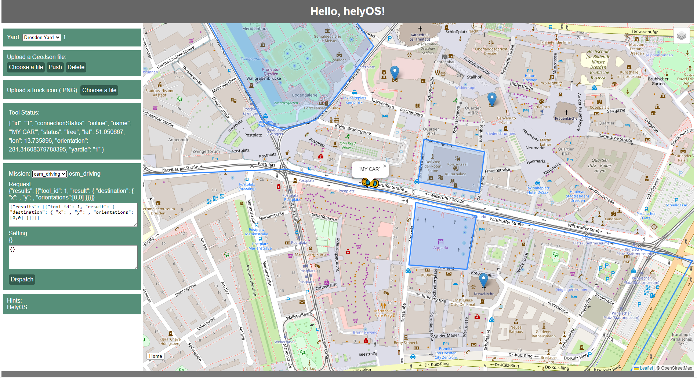

Complete helyOS App
===================
This chapter will demonstrates a whole **helyOS-based** web app built by **Vue.js** with ``Pinia`` stores and **Service Layer** introduced in previous chapters.

Static Resources
----------------

Firstly, add some static resources into *assets* folder:

*./assets/html/helyos-demo.html*

.. code:: 

    <header>
        
Hello, helyOS!

    </header>

    <section>
        <nav>
            <ul>
                <li>
                    

                        Yard:
                        <select id="selected-yard" v-model="yardStore.selectedYard" @change="initYard"
                            @mouseenter="hintMsg = 'helyosService.yard.list(condition?: Partial<H_Yard>): Promise<H_Yard[]>'"
                            @mouseleave="hintMsg = 'HelyOS'">
                            <option v-for="yard in yardStore.yards" :value="yard.id">{{ yard.name }}</option>
                        </select>
                        {{ yardStore.selectedYard }}
                    

                </li>
                <li>
                    Upload a GeoJson file:
                    

                        <input type="file" id="upload-geojson-btn" class="custom-input" @change="uploadGeoJson">
                        <label for="upload-geojson-btn" class="custom-btn"
                            @mouseenter="hintMsg = 'L.geoJSON(<Object> geojson?, <GeoJSON options> options?).addTo(map)'"
                            @mouseleave="hintMsg = 'HelyOS'">Choose a file</label>
                        <!-- 

                        
 -->
                        <button class="custom-btn" id="push-geojson-btn" @click="pushGeoJson"
                            @mouseenter="hintMsg = 'helyosService.shapes.create(shape: Partial<H_Shape>): Promise<any>'"
                            @mouseleave="hintMsg = 'HelyOS'">Push</button>
                        <button class="custom-btn" id="delete-geojson-btn" @click="deleteGeoJson"
                            @mouseenter="hintMsg = 'helyosService.shapes.delete(shapeId: any): Promise<any>'"
                            @mouseleave="hintMsg = 'HelyOS'">Delete</button>
                    

                </li>
                <li>
                    

                        Upload a truck icon (.PNG):
                        <label>
                            <input type="file" id="upload-icon-btn" class="custom-input" @change="updateToolIcon">
                            <label for="upload-icon-btn" class="custom-btn"
                                @mouseenter="hintMsg = 'helyosService.tools.patch(tool: Partial<H_Tools>): Promise<any>'"
                                @mouseleave="hintMsg = 'HelyOS'">Choose a file</label>
                        </label>
                    

                </li>
                <li id="tool-status-bar">
                    
Tool Status: {{ }}

                    
 { console.log(updates); }'"
                        @mouseleave="hintMsg = 'HelyOS'">
                        {{ toolStore.selectedToolInfo }}
                    

                </li>
                <li id="mission-bar">
                    

                        Mission:
                        <select v-model="workProcessStore.selectedMission" id="selected-mission" @change="initMission"
                            @mouseenter="hintMsg = 'helyosService.workProcessType.list(condition: Partial<H_WorkProcessType>): Promise<any>'"
                            @mouseleave="hintMsg = 'HelyOS'">
                            <option v-for="wpType in workProcessStore.workProcessType" :value="wpType.name">
                                {{ wpType.name }}
                            </option>
                            <option></option>
                        </select>
                        {{ workProcessStore.selectedMission }}
                    

                    

                        
Request:  {{ requestMsg }}

                        <textarea v-model="requestMsg" class="mission-info-textarea" contenteditable> </textarea>
                    

                    

                        
Setting:  {{ settingMsg }}

                        <textarea v-model="settingMsg" class="mission-info-textarea"> </textarea>
                    

                    

                        <button @click="createMission" class="custom-btn"
                            @mouseenter="hintMsg = 'helyosService.workProcess.create(workProcess: Partial<H_WorkProcess>): Promise<any>'"
                            @mouseleave="hintMsg = 'HelyOS'">Dispatch</button>
                    

                </li>
                <li id="hint">
                    Hints:
                    
{{ hintMsg }}

                </li>
            </ul>
        </nav>

        

            <Map ref="mapRef"></Map>
        

    </section>

    <footer>
        
Footer

    </footer>

*./assets/css/helyos-demo.css*

.. code:: css

    /* Header */
    header {
        background-color: #666;
        margin-top: 0;
        text-align: center;
        color: white;
    }

    #title {
        padding: 15px;
        margin-top: 0;
        font-size: 30px;
        font-weight: bold;
    }

    /* Flexboxes container */
    section {
        /* display: -webkit-flex; */
        display: flex;
    }

    /* Navigation menu */
    nav {
        width: 20%;
        height: 100%;
        /* -webkit-flex: 1;
        -ms-flex: 1;
        flex: 1; */
        background: rgba(204, 204, 204, 0);
        padding: 5px;
    }

    /* Navigation menu list */
    nav ul {
        list-style-type: none;
        padding: 0;
        margin: 0;
    }

    nav ul li {
        margin: 10px 0 0 0;
        padding: 10px;
        color: white;
        background-color: rgb(86, 143, 121);

    }

    /* Select box */
    select {
        width: auto;
        margin: 5px 0 5px 0;
    }

    /* Buttons */
    .custom-btn {
        font-size: 16px;
        font-weight: 500;
        padding: 5px;
        margin: 5px 5px 0 0;
        border: 0;
        border-radius: 5px;
        color: white;
        background-color: rgb(51, 92, 78);
        display: inline-block;
        cursor: pointer;
    }

    .custom-btn:hover {
        background-color: rgb(245, 86, 12);
    }

    .custom-input {
        width: 0.1px;
        height: 0.1px;
        opacity: 0;
        overflow: hidden;
        position: absolute;
        z-index: -1;
    }

    /* Tool status information panel */
    .tool-status {
        margin: 5px;
        line-height: 1.5;
    }

    /* Mission dialogue */
    .mission-info {
        word-wrap: break-word;
        margin: 5px;
    }

    .mission-info-textarea {
        margin-top: 5px;
        height: 60px;
        width: 100%;
    }

    /* Hint */
    .hint {
        display: block;
    }

    /* Right volume */
    #map-interface {
        /* -webkit-flex: 3;
        -ms-flex: 3;
        flex: 3; */
        width: 80%;
        height: 90vh;
        /* background-color: rgb(63, 64, 65); */
        padding: 0px;
    }

    /* Footer */
    footer {
        background-color: #777;
        padding: 5px;
        text-align: center;
        color: white;
    }

helyOS Interface
----------------

To initialize the connection and data fetching, you have to improve *Login.vue* a bit, which was built in :ref:`Web Interface and Routing<WebInterfaceAndRouting>` before.

Make sure to initialize helyOS connection and data fetching after login token confirmed.

*./components/Login.vue*

.. code:: typescript

    // login
    const login = async () => {

        // login into helyOS and get the helyOS Token
        const helyosToken = await HS.helyosLogin(loginForm.value.username, loginForm.value.password);
        console.log("tk", helyosToken);

        // login in successfully
        if (helyosToken) {
            loginForm.value.token = helyosToken;
            // store user information
            userStore.setUser(loginForm.value);

            // initialize helyOS connection and data fetching
            const connected = await HS.helyosConnect();
            console.log(connected);

            // routing to next page
            router.push({
                name: "demo",
            })
        } else {
            alert("Incorrect username or password!")
        }
    }

Then, the browser will route to another component *Helyos.vue*, which is the main helyOS interface:

*./components/Helyos.vue*

.. code:: html

    <template src="./../assets/html/helyos-demo.html"></template>  
    

    

helyOS Hello World
------------------

Congratulations! This is the end of this tutorial. If you follow this whole tutorial and everything works well, you will get a helyOS-based web app like the following 
figure shown.

    helyOS hello world app

The project built by this tutorial can be accessed by `helyOS hello world <https://gitlab-intern.ivi.fraunhofer.de/helyos/helyos-web-apps/helyos_hello_world>`_.