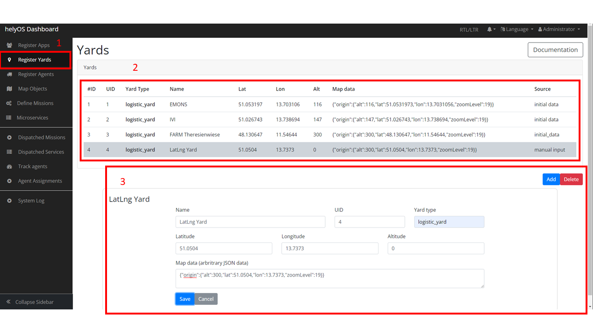
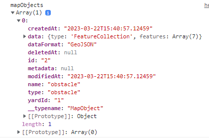
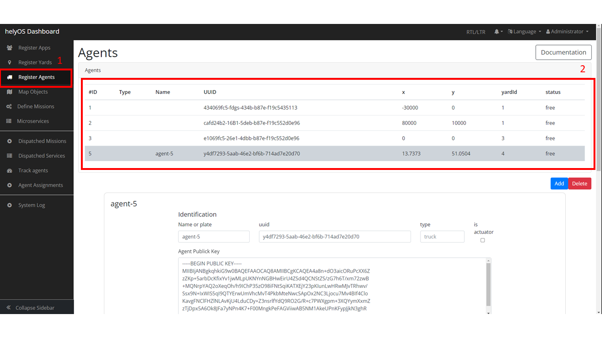
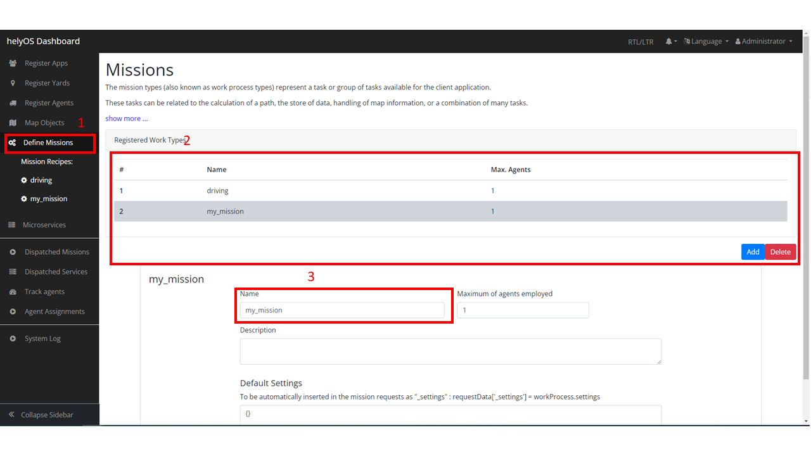
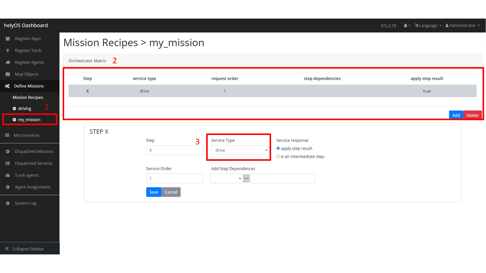
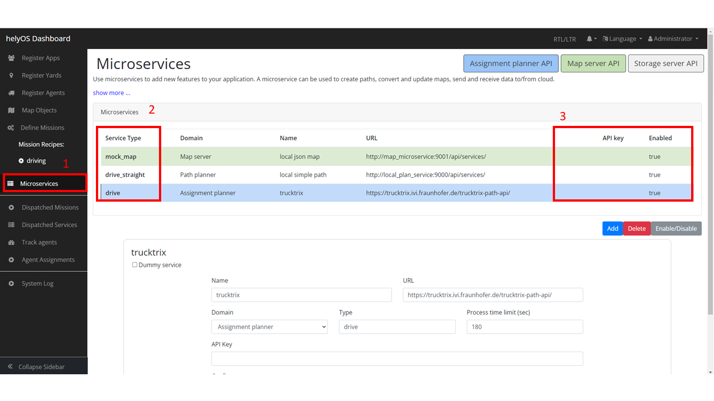

.. _helyosServiceLayer:

helyOS Service Layer
====================
This chapter demonstrates more usage examples in terms of helyOS classes by using ``helyosjs-sdk`` and ``Vue.js``. Each defined helyOS class has inside methods to implement 
CRUD operations. All of methods can be referred from `helyOS JavaScript SDK <https://fraunhoferivi.github.io/helyOS-javascript-sdk/index.html>`_.

After reading and following this page, you will have a single file service layer written by TypeScript. This service layer not only interacts with helyOS, but also store the data 
into frontend state management tool ``Pinia``.

helyOS HelyosServices
---------------------
Firstly, make sure you establish correct connection to helyOS core with ``HelyosServices``. 

*./services/helyos-service.ts*

.. code:: typescript

    import { HelyosServices } from 'helyosjs-sdk';
    import { useUserStore } from '@/stores/user-store';

    // define helyosService
    export const helyosService = new HelyosServices('http://localhost', { socketPort: '5002', gqlPort: '5000' });

    // login into helyOS core with the defined helyosService
    export const helyosLogin = (username: string, password: string) => {
        if (username && password) {
            return helyosService.login(username, password)
                .then(response => {
                    return response
                })
        }
    }

    // build Websocket connection
    export const helyosConnect = () => {

        // check if account's login token correct
        const userStore = useUserStore();
        console.log("userStore", userStore.user);

        if (userStore.user.token.jwtToken === helyosService.token) {
            return helyosService.connect()
                .then(connected => {

                    // setup helyOS after connection
                    helyosSetup();

                    return connected;
                })
        }
    }

    // helyOS setup after connected
    const helyosSetup = () => {
        /* Write your code here */
    }

Handling Yards
--------------
*Yard* in helyOS represents a delimited region where agents perform their assignments, and it contains map objects. You can easily observe or add/delete yards from helyOS 
database with helyOS Dashboard by following steps:

    Register yards by helyOS dashboard

1. Go to "Register Yards" view in `helyOS Dashboard <http://localhost:8080>`_.
2. Check all of yards information stored in helyOS database.
3. Add a new yard by filling in forms or delete existed yards.

Then you can also fetch yards data by ``helyosjs-sdk``, and store yards data into **yardStore**:

*./services/helyos-service.ts*

.. code:: typescript

    import { HelyosServices } from 'helyosjs-sdk';
    import { useYardStore } from '@/stores/yard-store'

    // helyOS setup after connected
    const helyosSetup = () => {
        listYards(); // fetch yards from helyos
    }

    ////////////////////////////Yards////////////////////////////
    // fetch yards from helyos
    const listYards = async () => {

        const yardStore = useYardStore();
        const yards = await helyosService.yard.list({});
        console.log("yards", yards);
        yardStore.yards = yards;
        
    }

Handling Map Objects
--------------------
*MapObject* is the digital representation of any map object inside the yard. The data type of shapes can be defined by developers, and the common used is **JSON/GeoJSON**. 
``helyosjs-sdk`` provides methods to implement CRUD operations for shapes:

*./services/helyos-service.ts*

.. code:: typescript

    import { HelyosServices, H_MapObject } from 'helyosjs-sdk';

    // helyOS setup after connected
    const helyosSetup = () => {    
        listMapObjects(); // fetch mapObjects from helyos
    }

    ////////////////////////////mapObjects////////////////////////////
    // fetch mapObjects from helyos
    export const listMapObjects = async () => {
        const mapObjectStore = useMapObjectStore();
        const mapObjects = await helyosService.mapObjects.list({});
        mapObjectStore.mapObjects = mapObjects;
        console.log("mapObjects", mapObjects);
    }

    // fetch mapObjects from helyos by yard id
    const listMapObjectsByYardId = async (yardId: string) => {
        const mapObjectStore = useMapObjectStore();
        const mapObjects = await helyosService.mapObjects.list({ yardId: yardId });
        mapObjectStore.mapObjects = mapObjects;
        console.log(mapObjectStore.mapObjects);
    }

    // create a new helyos mapObject
    export const pushNewMapObject = async (mapObject: H_MapObject) => {
        try {
            const newMapObject = await helyosService.mapObjects.create(mapObject)
            console.log("Push mapObject operation succeed!", newMapObject);
            listMapObjects();
            return newMapObject;
        }
        catch {
            console.log("Push mapObject operation failed!");
        }
    }

    // delete mapObject by id
    export const deleteMapObject = async (mapObjectId: any) => {
        try {
            const deletedMapObject = await helyosService.mapObjects.delete(mapObjectId);
            console.log("Delete mapObject operation succeed!", deletedMapObject);
            listMapObjects();
        }
        catch {
            console.log("Delete mapObject operation failed!");
        }
    }

A shape example should be like:

    A helyOS map object data structure

The property ``data`` can be used to store map objects ( *points, lines, polygons, ...* ).

Retrieving Agent Data 
---------------------
*Tool* is the digital representation of an agent, which is a device that receives assignments. It has status, position and sensors information of the agent. 
After installing helyOS Core, there will be three agent simulators running on your device, which means there are three tools data stored in helyOS database. 
You can also build a custom agent with `helyOS Agent SDK <https://pypi.org/project/helyos-agent-sdk/>`_. If you go to helyOS Dashboard, you can have a look of 
all of tools stored in your helyOS database:

    Register agents view of helyOS Dashboard

1. Go to "Register Agents" view in `helyOS Dashboard <http://localhost:8080>`_.
2. Check, edit, add or delete tools.

.. note:: 

    Different tools may have different coordinate system! In the above figure shown, the first three tools are trucktrix-map format, which use meter as unit, 
    and the last one is a custom agent, which use decimal latitude and longitude.

You can use ``helyosjs-sdk`` interacting with the tools:

*./services/helyos-service.ts*

.. code:: typescript

    import { HelyosServices, H_Tools } from 'helyosjs-sdk';
    import { useToolStore } from '@/stores/tool-store';

    // helyOS setup after connected
    const helyosSetup = () => {
        listTools(); // fetch tools from helyos
        toolSubscription(); // agents listener
    }

    ////////////////////////////Tools////////////////////////////
    // fetch tools from helyos
    export const listTools = async () => {
        const toolStore = useToolStore();
        const tools = await helyosService.tools.list({})
        toolStore.tools = tools;
        console.log("tools", tools);
        return tools
    }

    // modify a tool
    export const patchTool = (tool: H_Tools) => {
        try {
            const newTool = helyosService.tools.patch(tool);
            console.log("Patch tool operation succeed!", newTool);
            return newTool;
        }
        catch {
            console.log("Patch tool operation failed!");
        }
    }

    // agents listener
    const toolSubscription = () => {
        const socket = helyosService.socket;
        
        socket.on('new_tool_poses', (updates: any) => {
            console.log('new_tool_poses', updates); // Notifications from tool sensors.
        });
        socket.on('change_tool_status', (updates: any) => {
            console.log('change_tool_status', updates); // Notifications from tools working status.
        });
        socket.on('change_work_processes', (updates: any) => {
            console.log('change_work_processes', updates);  // Notifications from work processes status.
        });
    }

With agents listeners, your could track the status and location and agents. As an option, to update status and location information into frontend, you can use the following code:

.. code:: typescript

    // agents listener
    const toolSubscription = () => {
        const socket = helyosService.socket;
        const toolStore = useToolStore();
        const yardStore = useYardStore();
        socket.on('new_tool_poses', (updates: any) => {

            // console.log('new_tool_poses', updates); // Notifications from tool sensors.
            updates.forEach((agentUpdate: any) => {
                // console.log(agentUpdate);
                const agent = toolStore.tools.find(tool => tool.id === agentUpdate.toolId);
                if (agent) {
                    toolStore.ifSubscription = 1;
                    
                    if (agentUpdate.yardId === "4") 
                    {// latitude, longitude based tool
                        agent.x = agentUpdate.x;
                        agent.y = agentUpdate.y;
                        agent.orientation = agentUpdate.orientation;
                        agent.sensors = agentUpdate.sensors;
                        agent.status = agentUpdate.status;
                        agent.dataFormat = "LatLng-vehicle";

                    } 
                    else 
                    { // trucktrix-map based tool
                        const currentYard = yardStore.yards.find(yard => yard.id === agentUpdate.yardId);
                        const LatLng = helyosService.convertMMtoLatLng(currentYard.lat, currentYard.lon, [[agentUpdate.x, agentUpdate.y]]);

                        agent.x = LatLng[0][1];
                        agent.y = LatLng[0][0];
                        agent.orientation = agentUpdate.orientation;
                        agent.sensors = agentUpdate.sensors;
                        agent.status = agentUpdate.status;
                        agent.dataFormat = "LatLng-vehicle";
                    }
                }
            })
            // console.log("tool store", toolStore.tools);

        });
        socket.on('change_tool_status', (updates: any) => {
            console.log('change_tool_status', updates); // Notifications from tools working status.
        });
        socket.on('change_work_processes', (updates: any) => {
            console.log('change_work_processes', updates);  // Notifications from work processes status.
        });
    }

As there might be different coordinate units, you can use ``helyosService.convertMMtoLatLng`` or ``helyosService.convertLatLngToMM`` to convert coordinates.

Creating and Dispatching Missions 
---------------------------------
*WorkProcess* is the digital representation of a mission, which is usually originated from the client. The client creates a mission and helyOS uses the microservices to decompose 
the mission in several assignments. Then assignments are delivered to one or several agents. To create a mission, you have to create a new *WorkProcess* and insert it into helyOS 
database. The data inside *WorkProcess* will be forwarded to microservice linked to the *WorkProcessType* of mission. 

You can define the *WorkProcessType* in helyOS Dashboard:

    Define missions view of helyOS Dashboard

1. Go to "Define Missions" view in helyOS Dashboard.
2. Add, edit or delete missions (*WorkProcessType*).
3. The mission is stored as *WorkProcessType* in helyOS database.

    Mission (*WorkProcessType*) view of helyOS Dashboard

1. Go to defined mission under "Mission Recipes".
2. Add, edit or delete new mission recipe.
3. Link the mission to the microservice by selecting **Service Type**.

    Microservices view of helyOS Dashboard

1. Go to "Microservices" view in helyOS Dashboard.
2. The **Service Type** is selected when defining a mission recipe.
3. The **API Key** needed, and the **Enabled** should be *true*.

After defining missions and microservices enabled, you can use ``helyosjs-sdk`` to get previously defined *WorkProcessType* in helyOS Dashboard and dispatch new *WorkProcess*:

*./services/helyos-service.ts*

.. code:: typescript

    ////////////////////////////WorkProcess////////////////////////////

    import { HelyosServices, H_Shape, H_Tools, H_WorkProcess } from 'helyosjs-sdk';
    import { useWorkProcessStore } from '@/stores/work-process-store';

    // helyOS setup after connected
    const helyosSetup = () => {
        listWorkProcessType(); // fetch work process type from helyos
    }

    // fetch work process type from helyos
    const listWorkProcessType = async () => {
        const workProcessStore = useWorkProcessStore();
        const workProcessType = await helyosService.workProcessType.list({});
        workProcessStore.workProcessType = workProcessType;
    }

    // dispatch a new work process
    export const dispatchWorkProcess = async (workProcess: H_WorkProcess) => {
        console.log(workProcess);
        return await helyosService.workProcess.create(workProcess)
    }

Now, you have a service layer build using ``helyosjs-sdk``, which serves interacting with helyOS database and provides methods for business layer of web app. Besides above usage 
examples, you can also build other methods referring to `helyOS JavaScript SDK <https://fraunhoferivi.github.io/helyOS-javascript-sdk/index.html>`_.