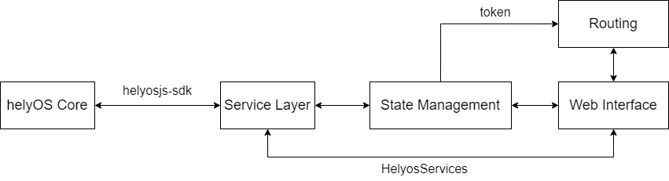
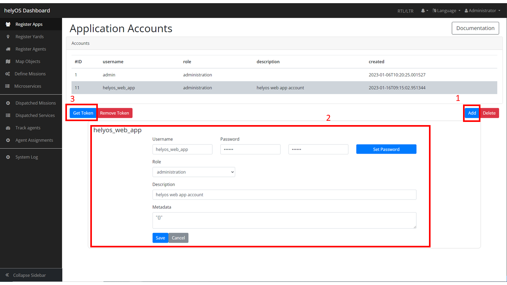
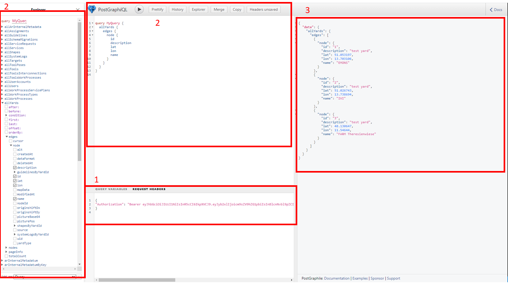
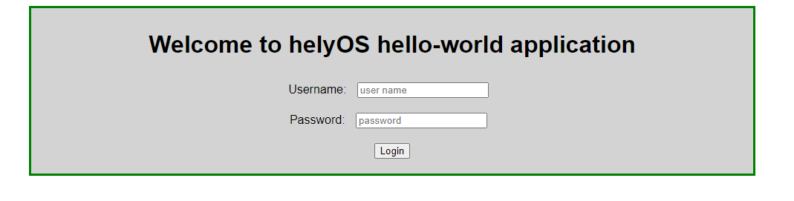
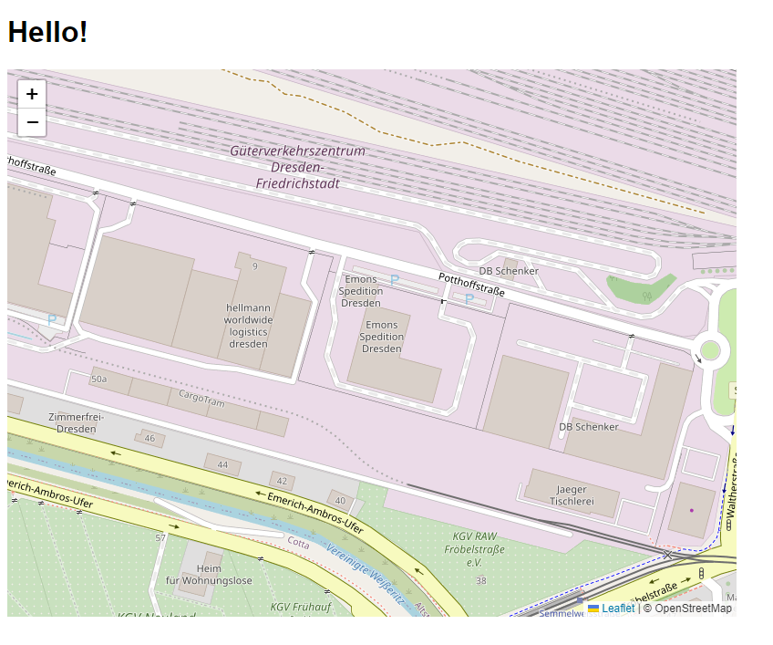

.. _helyOSWithVue:

Overview
========
This page assumes you've already read the first step on :ref:`Getting Started <GettingStarted>`. In this chapter, you will learn more features of helyOS and how to develop 
a web application within helyOS framework. This chapter will start by introducing a frontend framework of helyOS-based application, and more usage examples by using this framework.

.. note:: 

    Before starting, make sure you have following packages/tools prepared:

        - helyOS Core
        - helyosjs-sdk
        - Leaflet Map
        - Vue.js and TypeScript support

Frontend Framework
------------------

    A frontend framework of helyOS-based application

To develop a modern and well-structured web application, this tutorial uses a data-oriented multilayer structure to implement the communications with helyOS Core as above 
frontend framework shown. At first, **Service Layer** serves interactions with helyOS database by ``helyosjs-sdk``, and data will be stored into ``Pinia`` store, 
which is a popular state management library for ``Vue.js``. **Web interfaces** controlled by **Routing** can get data from store and also can inspire services from **Service Layer**.

helyOS Core and GraphiQL
------------------------
The helyOS core is a single NodeJS application serving the ports 5000, 5002, and 8080, respectively for the **PostGraphile GraphiQL**, **Websocket connections** and **dashboard GUI**. 
helyOS core responds to database events. That is, the creation, update or delete of rows in the database tables trigger actions inside the helyOS core. Therefore the client 
applications communicate with helyOS core by interacting with the helyOS database by ``GraphQL language``. During the development of helyOS-based web app, **helyOS Dashboard** and **GraphiQL** 
are very helpful for developers to observe the data inside helyOS database.

To use Dashboard and GraphiQL, you should login from `helyOS Dashboard Login <http://localhost:8080/login>`_. At your first login time, you can use *{username: admin, password: admin}*. 
After login successfully, go to **Register Apps** page at which you can manage all of application accounts, and create a new account for your web application by following steps:

    Create a new helyOS app account

1. Press **Add** button and press new added account.
2. Complete account information and press **Save** button.
3. Press **Get Token** button, then you will get the **Authorization Token** which can be used at GraphiQL.

To view helyOS database by using GraphiQL, with the **Authorization Token** from helyOS Dashboard, you can query data from helyOS database by following steps:

    Query data by GraphiQL

1. Replace {"Authorization": **null**} by your **Authorization Token**.
2. Query data either by checkbox or by GraphQL Language and press **Triangle** button.
3. Queried data will be shown at the right panel.

With these two portals, you can access to all of data stored in helyOS database, which will be helpful for your development process.

Service Layer
-------------
This is where the frontend interacts with the backend and provides tools for frontend logics. In our case, all of operations with helyOS will be separated and written in a single 
TypeScript file *./services/helyos-service.ts*. Here is a basic example how to use service layer by ``helyosjs-sdk`` to provide **login into helyOS** function:

*./service/helyos-service.ts*

.. code:: TypeScript

    // import helyosjs-sdk package
    import { HelyosServices } from 'helyosjs-sdk';
    import { useUserStore } from '@/stores/user-store'; // user store will be defined later

    // define helyosService object
    export const helyosService = new HelyosServices('http://localhost', { socketPort: '5002', gqlPort: '5000' });

    // login into helyOS core with the defined helyosService
    export const helyosLogin = (username: string, password: string) => {
        if (username && password) {
            return helyosService.login(username, password)
                .then(response => {
                    return response
                })
        }
    }

    // build Websocket connection
    export const helyosConnect = () => {

        // check if account's login token correct
        const userStore = useUserStore();
        console.log("userStore", userStore.user);

        if (userStore.user.token.jwtToken === helyosService.token) {
            return helyosService.connect()
                .then(connected => {

                    // setup helyOS after connection
                    helyosSetup();

                    return connected;
                })
        }
    }

    // helyOS setup after connected
    const helyosSetup = () => {
        /* Write your code here */
    }

Once you login in successfully, the connection to helyOS core was built by **helyosService**, and returned **response** containing the jwtToken of the user.

Besides login function, other operations interacting with helyOS should be written in ``helyosSetup()``, which will be executed after helyosService connected.

.. _StateManagementOverview:

State Management
----------------
`Pinia <https://pinia.vuejs.org/introduction.html>`_ is a store library for Vue, it allows you to share a state across components/pages. You can install ``pinia`` with your 
favorite package manager:

.. code:: 

    > npm install pinia
    # or with yarn
    > yarn add pinia

Import pinia at *./main.ts*:

*./main.ts*

.. code:: typescript

    import { createApp } from 'vue'
    import App from './App.vue'
    import { createPinia } from 'pinia' // import pinia package

    createApp(App)
        .use(createPinia()) // install pinia into your vue app
        .mount('#app')

After installation, you can define a Store in a way similar to a vue component ``setup()``. Here is an example of userStore:

*./stores/user-store.ts*

.. code:: typescript

    import { defineStore } from 'pinia'
    import { ref } from 'vue'

    // define user type
    export type User = { username: string; password: string; token: string};

    // define a Store
    export const useUserStore = defineStore("user", ()=>{

        // define a user type state
        const user = ref({} as User)

        // define an action that set user's data into userStore
        const setUser = (userInfo: User)=>{
            user.value = userInfo;
        }

        // expose states and actions
        return{
            user,
            setUser
        }
    })

And then you use it in a component:

.. code:: typescript

    import { ref } from 'vue'
    import { useUserStore, type User } from '@/stores/user-store';

    // define a user
    const userTest = ref({
        username: 'admin',
        password: 'admin',
        token: ''
    } as User);

    // define the userStore 
    const userStore = useUserStore();

    // use the action from userStore
    userStore.setUser(userTest.value);

    // print user information at console
    console.log("User: ", userStore.user);

It's better to define different stores respectively for different states depending on demands.

.. _WebInterfaceAndRouting:

Web Interface and Routing
-------------------------
Vue is a component-based framework, which means a whole page can consist of multiple components. This tutorial will use three components to build an web app:

- Login.vue
- LeafletMap.vue
- Helyos.vue

`Vue Router <https://router.vuejs.org/guide/>`_ is used with vue.js to make page routing easily. Then this tutorial will use ``vue-router`` to implement a router guard 
that control the routing between login page and main page based on if **helyesToken** exists.

Firstly, to install ``vue-router``, use the following command:

.. code:: 

    > npm install vue-router@4

And import router into *./main.ts*:

.. code:: typescript

    import { createApp } from 'vue'
    import App from './App.vue'
    import { createPinia } from 'pinia'
    import router from './router' // import router

    createApp(App)
        .use(createPinia())
        .use(router)  // install router
        .mount('#app')

Create a new folder *./router* and a new typescript file *./router/index.ts*: 

.. code:: typescript

    import { createRouter, createWebHistory } from 'vue-router'
    import Login from '../components/Login.vue'
    import Helyos from '@/components/Helyos.vue'
    import { useUserStore } from '@/stores/user-store';

    const routes = [
        {
            path: '/',
            name: 'login',
            component: Login
        },
        {
            path: '/demo',
            name: 'demo',
            component: Helyos
        }
    ]

    const router = createRouter({
        history: createWebHistory(process.env.BASE_URL),
        routes
    })

    router.beforeEach((to, from, next)=>{
        const userStore = useUserStore();
        const token = userStore.user.token;
        if(token || to.path === '/'){
            next();    
        }else{
            next("/");
        }   
    })

    export default router

Update *./App.vue* with the following code: 

*./App.vue*

.. code::

    

    <template>
        <router-view/>
    </template>

*./assets/main.css*

.. code:: css

    /* App */
    #app {
        /* max-width: 1280px; */
        font-family: Arial, Helvetica, sans-serif;
        font-weight: normal;
        margin: 0;
        padding: 0;
        /* padding: 2rem; */
        background-color:white;
    }
    
    

Create two different vue components *./components/Login.vue* and *./components/Helyos.vue*: 

*./components/Login.vue*

.. code::

    <template>
        

            <h1>Welcome to helyOS hello-world application</h1>
            
Username:
                <input type="text" v-model="loginForm.username" placeholder="user name" />
            

            
Password:
                <input type="password" v-model="loginForm.password" placeholder="password" />
            

            <button @click="login">Login</button>
        

    </template>

    

    

*./components/Helyos.vue*

.. code:: 

    <template>
        <h1>Hello!</h1>
        

    </template>

    

    

Now run the project with ``npm run dev``, you will see the helyOS login interface routed from *./components/Login.vue*. Then you can login in with the username and password 
which are stored in helyOS Dashboard, and you will see the page routed from *./components/Helyos.vue*. Once you refresh the browser, it will go to login interface again.

    helyOS login interface

    helyOS after-login interface

Now you have prepared everything you need to build an web app within helyOS framework. From this point, you can either start building your own app or keep following the rest 
parts of this tutorial to learn more features.

Complete Project Tree
---------------------
A complete project tree of this tutorial is shown below::

    .
    └── project/
        ├── src/
        │   ├── App.vue
        │   ├── main.ts
        │   ├── assets // static resources
        │   ├── components/
        │   │   ├── Login.vue // login interface
        │   │   ├── leafletMap.vue // contains leaflet map view and all of leaflet api
        │   │   └── Helyos.vue // main conponent, displays tools, shapes, yards, workprocess and map
        │   ├── router/
        │   │   └── index.ts // guide the pages
        │   ├── services/
        │   │   └── helyos-service.ts // helyos sdk api
        │   └── store/
        │       ├── leaflet-map-store.ts // stores map ref()
        │       ├── shape-store.ts // stores shapes and provides push, delete shape operations
        │       ├── tool-store.ts //stores tools and status information
        │       ├── user-store.ts // stores user information and jwtToken
        │       ├── work-process-store.ts // stores work process type and dispatch new work process
        │       └── yard-store.ts // stores yard information
        ├── public
        ├── docker-compose.yml
        ├── dockerfile
        ├── env.d.ts
        ├── index.html
        ├── package-lock.json
        ├── package.json
        ├── README.md
        ├── tsconfig.config.json
        ├── tsconfig.json
        └── vite.config.ts

Keep going, you will continue to complete your own project by learning more detailed operations interacting with helyOS.

