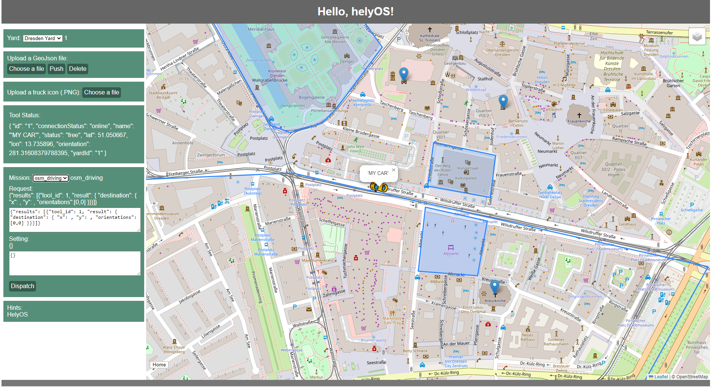

Welcome to Frontend App for helyOS Tutorial
===========================================

Welcome to helyOS frontend application tutorial. This tutorial aims at introducing how to build a Saas-based web application within helyOS framework. After following this tutorial, an 
autonomous driving control station application is expected like the following figure shown.

   helyOS hello world app

The complete hello helyOS project can be accessed by `helyOS hello world <https://github.com/FraunhoferIVI/helyos-frontend-example>`_.

.. toctree::
   :maxdepth: 2
   :caption: First Step
   
   1-introduction/introduction
   1-introduction/getting-started

.. toctree:: 
   :maxdepth: 2
   :caption: Main Features

   2-main-features/helyos-main-features

.. toctree:: 
   :maxdepth: 2
   :caption: helyOS with Vue.js

   3-helyOS-vue/helyos-vuejs-app
   3-helyOS-vue/helyos-service-layer
   3-helyOS-vue/helyos-state-management
   3-helyOS-vue/helyos-complete-app