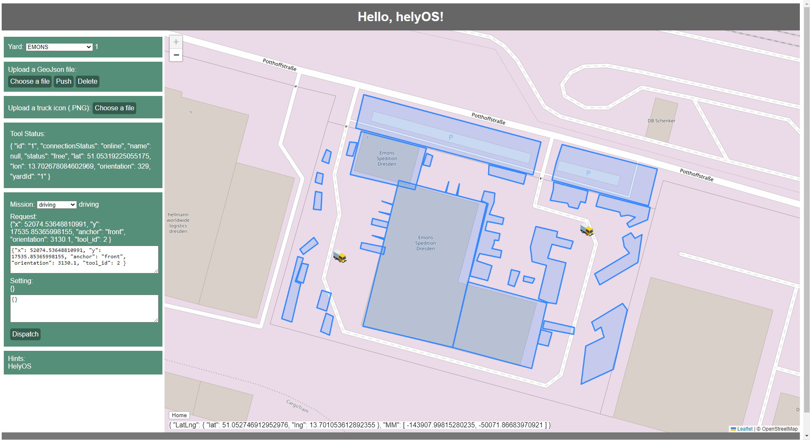

# Frontend App of helyOS

This is a simple web application demo of an autonomous driving control station built within helyOS framework. The tutorial of how to built this application can be found by [Frontend App for helyOS](https://fraunhofer-ivi-helyos-frontend-example.readthedocs.io/en/latest/index.html).

## 1. Environment

* helyOS Core
* Node.js
* Vue3
* TypeScript
* Docker

## 2. Build

Make sure you have **helyOS Core** installed on your device.

### NPM
**Project Setup**
> npm install

**Compile and Hot-Reload for Development**
> npm run dev

**Type-Check, Compile and Minify for Production**

> npm run build

Visit via http://localhost:5174

### Docker

**Build image**
> docker run -t ***imageName:version*** .

**Tag image**
>docker tag ***imageName:version*** ***imageName:new_version***

**Run image as a container**
>docker run -d -p ***5174:5174*** --name ***containerName*** ***imageName:version***
    >>The port is 5174, which is set in ./vite.config.ts

Visit via http://localhost:5174

### Docker Compose

**Build image and run it as a container**
>docker-compose up -d

**Rebuild the image**
>docker-compose up --build -d

## 3. DevLog

- configure *server* within *./vite.config.ts*

```javascript
import { fileURLToPath, URL } from 'node:url'
import { defineConfig } from 'vite'
import vue from '@vitejs/plugin-vue'

// https://vitejs.dev/config/
export default defineConfig({
plugins: [vue()],
resolve: {
    alias: {
    '@': fileURLToPath(new URL('./src', import.meta.url))
    }
},
// localhost:port
server: {
    host: true,
    port:5174
}
})
```
## 4. Main Features

- helyOS
  - HelyosService websocket connection
  - helyOS Yard
    - Fetch all of yards from helyOS database
    - Switch yard
  - helyOS Shapes
    - Fetch all of shapes from helyOS database
    - Push new helyOS Shapes into helyOS database (GeoJSON)
    - Delete helyOS Shapes
  - helyOS Tools
    - Fetch all of tools from helyOS database
    - Track status and location of tools
    - Patch the icon of tools
  - helyOS WorkProcess
    - Fetch all of WorkProcessType created in helyOS Dashboard
    - Dispatch a new WorkProcess
- Leaflet Map
  - Map view
  - Map control (home button)
  - Display GeoJSON file
  - Display helyOS models

## 5. Project Tree
```
.
└── project/
    ├── src/
    │   ├── App.vue
    │   ├── main.ts
    │   ├── assets // static resources
    │   ├── components/
    │   │   ├── Login.vue // login interface
    │   │   ├── leafletMap.vue // contains leaflet map view and leaflet methods
    │   │   └── Helyos.vue // main component, displays tools, shapes, yards, workprocess and map
    │   ├── router/
    │   │   └── index.ts // guide the pages
    │   ├── services/
    │   │   └── helyos-service.ts // helyos sdk api
    │   └── store/
    │       ├── leaflet-map-store.ts // stores map ref()
    │       ├── shape-store.ts // stores shapes and provides push, delete shape operations
    │       ├── tool-store.ts //stores tools and status information
    │       ├── user-store.ts // stores user information and jwtToken
    │       ├── work-process-store.ts // stores work process type and dispatch new work process
    │       └── yard-store.ts // stores yard information
    ├── public
    ├── docker-compose.yml
    ├── dockerfile
    ├── env.d.ts
    ├── index.html
    ├── package-lock.json
    ├── package.json
    ├── README.md
    ├── tsconfig.config.json
    ├── tsconfig.json
    └── vite.config.ts

```


## 6. Demo 




